<br/>
<br/>
<br/>
<br/>
<br/>
<br/>
<br/>
<br/>
<br/>
<br/>
<br/>
<br/>
<div style="text-align: center;">
<h1> E-Kit EnOcean IoT ゲートウェイ 取扱説明書</h1>
<br/>
<br/>
<br/>
<br/>
<br/>
<br/>
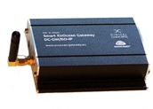
</div>
<br/>
<br/>
<br/>
<br/>
<br/>
<br/>
<br/>
<br/>
<br/>
<br/>
<br/>
<br/>
<div style="text-align: right;">
株式会社デバイスドライバーズ<br/>
2020年6月22日 第2版<br/>
配布元 <a href="https://devdrv.github.io/E-Kit-Gateway-Manual/">
https://devdrv.github.io/E-Kit-Gateway-Manual/</a>
</div>

<div style="page-break-before:always"></div>

## 目次

<!-- TOC -->

- [1. はじめに](#1-はじめに)
	- [1.1. 安全上のご注意](#11-安全上のご注意)
	- [1.2. 製品概要](#12-製品概要)
	- [1.3. 機能](#13-機能)
		- [1.3.1. 基本機能](#131-基本機能)
		- [1.3.2. サービス接続機能](#132-サービス接続機能)
- [2. 起動とネットワーク接続](#2-起動とネットワーク接続)
	- [2.1. IPアドレス](#21-ipアドレス)
	- [2.2. ゲートウェイのIPアドレス探索](#22-ゲートウェイのipアドレス探索)
		- [2.2.1. 探索手順](#221-探索手順)
- [3. 基本機能](#3-基本機能)
	- [3.1. 基本操作](#31-基本操作)
		- [3.1.1. ログイン](#311-ログイン)
		- [3.1.2. コントロールページ](#312-コントロールページ)
		- [3.1.3. シャットダウンと再起動](#313-シャットダウンと再起動)
		- [3.1.4. ログアウト](#314-ログアウト)
	- [3.2. EnOcean 設定](#32-enocean-設定)
		- [3.2.1. 登録済デバイスの表示](#321-登録済デバイスの表示)
		- [3.2.2. センサーデバイスの新規登録](#322-センサーデバイスの新規登録)
		- [3.2.3. センサーデバイスの追加登録](#323-センサーデバイスの追加登録)
		- [3.2.4. 運用](#324-運用)
	- [3.3. iBRESS / ETK 設定](#33-ibress--etk-設定)
	- [3.4. Azure IoT Hub 設定](#34-azure-iot-hub-設定)
	- [3.5. OPC UA 設定](#35-opc-ua-設定)
	- [3.6. システム 設定](#36-システム-設定)
		- [3.6.1. IPアドレス設定](#361-ipアドレス設定)
		- [3.6.2. ユーザー設定](#362-ユーザー設定)
		- [3.6.3. バージョン情報表示](#363-バージョン情報表示)
	- [3.7. モニター機能](#37-モニター機能)
	- [3.8. ログ機能](#38-ログ機能)
		- [3.8.1. ログファイル名](#381-ログファイル名)
		- [3.8.2. ログファイル一覧](#382-ログファイル一覧)
		- [3.8.3. ログファイル表示](#383-ログファイル表示)
	- [3.9. ファームウェア更新](#39-ファームウェア更新)
- [4. 補足情報](#4-補足情報)
	- [4.1. 緊急用IPアドレスへの接続](#41-緊急用ipアドレスへの接続)
		- [4.1.1. 自マシンのアドレス追加](#411-自マシンのアドレス追加)
- [5. サポートと保証](#5-サポートと保証)

<!-- /TOC -->

<div style="page-break-before:always"></div>

## 1. はじめに

このたびは、E-Kit EnOcean ゲートウェイをご購入頂きまして、ありがとうございます。
ご使用前に次項の「安全上のご注意」に気を付けて、安全にお使いください。

### 1.1. 安全上のご注意

本機器は、電波法に準拠したEnOcean 省電力無線通信技術に基づいた製品です。電源（ACアダプター）部分の誤った使い方をした場合には、事故が発生する場合もあるので、次の通り十分気を付けてご利用ください。
- 異様なにおいや音がするなど、異常があった場合はすぐにACアダプターを抜いて電源を切ってください。
- 本装置に接続するACアダプターは、PSEマーク付きの製品添付のものだけを使用してください。
- ACアダプターの本体、コードやプラグを改造して使用しないでください。
- ACアダプターは100V～240V, 50～60Hz, 0.3Aの定格です。定格外の電源に接続しないでください。
- USBとLAN用のコネクターには、規格外の機器を接続しないでください。

### 1.2. 製品概要

E-Kit EnOcean ゲートウェイは、EnOcean 無線通信プロトコルに準拠した各種のEnOcean センサーから送信される信号を受信して、TCP/IP に変換して出力する機器です。

E-Kit EnOcean ゲートウェイは、EnOcean 無線通信プロトコルに準拠した各種のEnOcean センサーから送信される信号を受信して、TCP/IP に変換して出力する機器です。E-Kit EnOcean ゲートウェイでは、[ドイツ Digital Concepts社開発の Smart EnOcean Gateway](http://enocean-gateway.eu/en/product/)  をベースに、オープンソースの独自ソフトウェアを搭載することで、拡張性が高く使い易い機能を実現しています。次の特長を持ちます。

- Web UI
	全ての機能をブラウザから操作可能な、使い易いWEB ユーザーインターフェースを備えます。

- EnOcean Profile 
	EPとGPのTeach-In テレグラムに対応し、LEARN ボタンにより EP/GP の EnOcean Profile を各デバイス固有の ID とともに登録、管理します。

- 各種サービス
	iBRESS ETK, Microsoft Azure, OPC UA (Industry 4.0 推奨プロトコル) の各サービスに対応済で、すぐに利用できます。対応サービスは今後さらに拡充予定です。

- モニター
	EnOcean テレグラム・モニター 機能を備え、運用中の電波状況を確認できます。

- ログ
	本体操作、EnOcean テレグラム受信、各種サービスのログ管理と表示機能を持ちます。

- ファームウェア更新
	ファームウェア更新により、最新機能や個別対応機能を利用できます。

なお本システムソフトウェアと本説明書は、不具合の解消や新機能の追加に伴って、予告なくバージョンアップ（内容を更新）する場合があります。また更新の有無に関わらず、説明画面や説明内容が、多少実際とは異なる場合がありますが、ご了承をお願いします。問題点のご報告やご要望は「e-kit@devdrv.co.jp」宛に、メールでご連絡をお願いします。

### 1.3. 機能

本製品の機能を「基本機能」と各サービスに固有の「拡張機能」に分けて、より詳細に説明します。

#### 1.3.1. 基本機能

本製品の基本的な機能です。

- 専用ケース

    付属金具等などにより様々な場所に設置可能な、取り付け穴付きの頑丈な専用アルミニウムケースを採用しています。トルクスネジ採用で、容易に開けられない構造となっています。

- 日本国内向け専用EnOcean 無線通信

    総務省の認可を受けた928.35MHz / FSKのEnOcean無線通信の受信をサポートしています。専用アンテナにより電波受信感度を増強しています。

- EnOcean Profile とIDフィルター

    EEP (Enocean Equipment Profile) と GP (Generic Profile)  によるセンサーの識別と、登録済センサーのIDフィルター機能をサポートしています。

- Web UI

    PC やスマートフォン等のブラウザから専用の Web インターフェースページにアクセスして、各種設定・操作と機器管理が可能です。

- uPnPによるゲートウェイ発見

    uPnP を搭載しているため、DHCP使用時でも容易に本装置のIPアドレスを発見して、操作用のホームページにアクセスが可能です。 

- ファームウェア更新

    Web UIにアクセスして、ファームウェア更新を行うことが可能です。

#### 1.3.2. サービス接続機能

E-Kit EnOcean ゲートウェイでは次の各種サービスへの接続機能をサポートしています。これらの機能は今後、拡充、更新される場合があります。

- [Skkynet ETK](https://skkynet.com/etk/)

    カナダSkkynet Cloud Systems, Inc.社の組込みシステム開発用データ転送技術「ETK」を搭載して、iBRESS Cloud / Cogent Datahub 等への接続をサポートしています。

- [OPC UA サーバー](https://opcfoundation.org/about/opc-technologies/opc-ua/)

    [Open62541](https://open62541.org/) のサーバー側を移植搭載して、OPC UA サーバー機能を実装しています。

- [Azure IoT Hub](https://azure.microsoft.com/services/iot-hub/)

    Microsoft Azure IoT Hub へのデータ転送と IoT Hub Device ID の自動更新機能をサポートします。

## 2. 起動とネットワーク接続

本装置は、TCP/IP有線LAN回線に接続することで、EnOcean無線データを転送することが可能です。

アンテナを装着し、Ethernetコネクターをインターネット接続可能な回線に接続してから、ネットアンテナ側の「5V DC」コネクターに、製品添付のACアダプターを差し込んで電源を投入します。**電源スイッチはありません。LED点灯後約30秒程度で利用可能になります。**

### 2.1. IPアドレス

E-Kit EnOcean ゲートウェイは次の2種類のIPアドレスを持っています。IPV4アドレスだけを扱い、IPV6アドレスは使用しません。

- 通常運用IPアドレス

    通用運用時のIPアドレスは、「システム設定ページ」の設定により、DHCP（デフォルト）と固定IPアドレスを選択して設定可能です。

- 緊急IPアドレス

    192.168.249.249 (サブネット マスク255.255.255.0＝24ビット) の固定IPアドレスを持っています。トラブル発生時、または緊急時に接続するためのアドレスなので変更できません。

以降はWebブラウザからE-Kit EnOcean ゲートウェイに接続するための手順について説明します。

- DHCPが利用可能な場合

接続するネットワーク環境でDHCPを用意している場合は、 ゲートウェイをネットワークに接続するための設定は必要ありません。次項の「ゲートウェイのIPアドレス探索」の説明に従ってゲートウェイのアドレスを発見後、Webページにアクセスしてください。

- DHCPが利用できない場合

接続するネットワーク環境でDHCPが利用できない場合、 ゲートウェイを固定IPアドレスに設定して使用します。ゲートウェイのデフォルト設定がDHCPになっているため、一度DHCP環境でゲートウェイに接続、ログインしてシステム設定のIPアドレスを設定する必要があります。ゲートウェイが接続するネットワーク環境でDHCPが利用できない場合は、緊急用IPアドレスに接続して設定する方法があります。詳細手順は「補足情報」 4.1 項「緊急用IPアドレスへの接続」を参照してください。

### 2.2. ゲートウェイのIPアドレス探索

ブラウザで E-Kit EnOcean ゲートウェイにアクセスする場合、接続先のアドレスを指定する必要があります。

なおDHCPを使用せず、固定IPを設定している場合でも、同様の手順でゲートウェイのIPアドレスを確認することが可能です。
 
#### 2.2.1. 探索手順

uPnPに対応したWindows搭載PCを使用した、IPアドレスの探索手順を示します。探索する場合は、最初にWindows PCをE-Kit EnOcean ゲートウェイと同じサブネットのネットワークに接続して、次の方法で確認します。

- コンピューターの「ネットワーク」を開きます。

- 画面中央部にある「ネットワークインフラストラクチャ」のカテゴリにある「Linux Internet Gateway Device」のアイコンを開きます。このアイコンが表示されるには、ゲートウェイの電源投入後約30秒程度かかります。

<div style="text-align: center;">
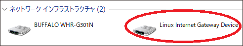<br/>
画面　「ネットワークの表示」
</div>

- 開いたプロパティ画面の一番下に表示されたIPアドレスが接続先のゲートウェイのIPアドレスなので、ブラウザの接続先にコピーして接続します。

<div style="text-align: center;">
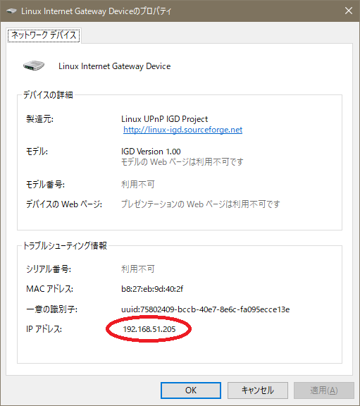<br/>
画面　ネットワークデバイス
</div>

## 3. 基本機能

E-Kit EnOcean ゲートウェイは、Webブラウザを使用して「ゲートウェイ コントロール」と呼ぶ、ゲートウェイが用意するホームページにアクセスして操作します。
この章では、ゲートウェイ コントローラーを使用して操作できる機能を解説します。

### 3.1. 基本操作

ログイン、ログアウトとシャットダウンなどの基本的な操作を説明します。

#### 3.1.1. ログイン

初めてコントロールページにアクセスする場合は、ログイン画面が表示されるので、Usernameに「admin」、Passwordに「admin」を入力後「Login」をクリックして接続します。

ログイン状態は、ログアウトするかブラウザを閉じるまでの間、継続します。UsernameとPasswordはログイン後に設定可能となる「システム設定」ページで変更することができます。

<div style="text-align: center;">
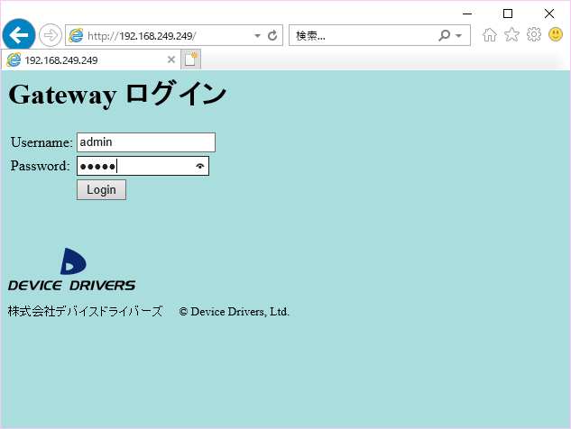<br/>
画面　Gateway ログイン
</div>

#### 3.1.2. コントロールページ

ログインに成功すると、次の様なメイン操作画面の「コントロールページ」が表示されます。E-Kit EnOcean ゲートウェイの基本操作は、このページで行います。次のコントロールページの各項目の役割を説明します。

<div style="text-align: center;">
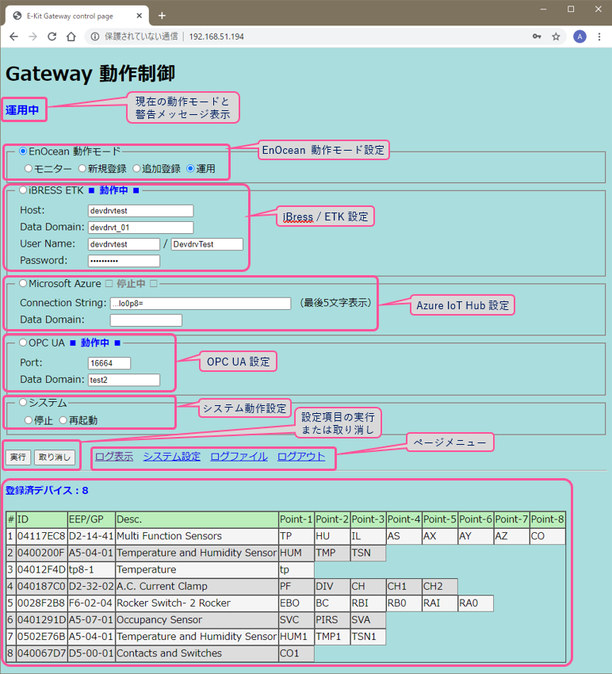<br/>
画面　コントロールページ
</div>

#### 3.1.3. シャットダウンと再起動

コントロールページの「システム」グループのラジオボタンを選択して「停止」または「再起動」を設定後、「実行」ボタンのクリックでシステム全体がシャットダウン、または再起動します。シャットダウン後もアンテナ横の青色LEDは点灯したままです。電源が切れたかどうかは、LANケーブルコネクタのLEDが消灯したことで判断します。電源ボタンはありません。電源断後の再起動時は、ACアダプターのケーブルを抜き差ししてください。

<div style="text-align: center;">
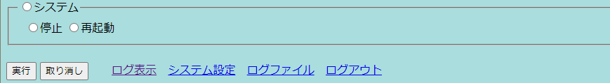<br/>
画面　シャットダウン、再起動とログアウト
</div>

#### 3.1.4. ログアウト

コントローラーページの「ログアウト」リンクをクリックすることで、すぐにログアウトしてログイン画面に遷移します。
ログアウトしても、各種ゲートウェイ機能は動作したままです。

### 3.2. EnOcean 設定

E-Kit EnOcean ゲートウェイは、次のEnOcean動作モードに対応した、EnOceanセンサーの受信機能を提供します。
EnOcean受信動作モードの設定は、「EnOcean動作モード」ラジオボタン選択後、「動作モード」のラジオボタンを選択して、「実行」ボタンをクリックして確定します。

<div style="text-align: center;">
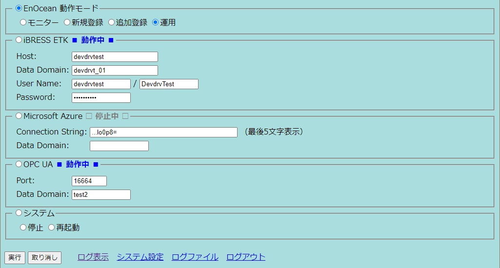<br/>
画面　EnOcean 動作モード設定
</div>

- モニター

	センサー登録の有無に関わらず、すべてのセンサーからのデータを受信して受信状況を電波強度とともに表示します。ゲートウェイとしてのデータの転送は行いません。この機能は主に、環境やセンサーデバイスの動作テストとして利用することを想定しています。

- 新規登録

	このモードで動作中は、現在の全センサーの登録情報を破棄して、センサーの LEARN ボタン押下による「Teach In」テレグラムを受信して、テレグラム フィルターに追加登録を行います。

- 追加登録

	各センサーの LEARN ボタン押下による「Teach In」テレグラムを受信して、テレグラム フィルターに追加登録を行います。RPSテレグラムを使用するロッカースイッチには LEARN ボタンが無いため、いずれかのボタン動作で登録が完了します。

- 運用

	ゲートウェイに登録済のセンサーやスイッチデバイスからのデータを受信してゲートウェイ転送する、通常運用時の動作モードです。電源投入後はこのモードで動作しています。

#### 3.2.1. 登録済デバイスの表示

E-Kit EnOcean ゲートウェイに登録されたEnOceanデバイス（各種センサーとスイッチ類）は登録済デバイスとして、コントローラーページに次の様に表示されます。

- ID

	ID はEnOceanデバイス固有のIDです。各通信デバイス製造時に割り当て済で、変更不可なためセンサーデバイスを識別するために使用します。

- EEP/GP

	EEP/GP フィールドには、各デバイスと送受信するテレグラムの内容を詳細に示す、EP(EnOcean Equipment Profile) と GP (Generic Profile)のいずれかが設定されます。「A5-04-01」の様に6桁の16進数で表示されるのがEEPで、英小文字を含むものがGPです。ともに [EnOcean Alliance](https://www.enocean-alliance.org/specifications/)で管理されています。

	EEPでは各EEPで定義されている「Shortcut Name」をポイント名としてそのまま使用します。GPには「Shortcut Name」や表示のための番号が規定されていないため、E-Kit EnOcean ゲートウェイ独自の割り当て文字を使用しています。	いずれも、重なった場合には「1～999」の数字を末尾に追加して割り当てます。登録可能なセンサーデバイス最大数は、デバイスIDフィルター登録上限の最大100台です。

- Desc.
	各プロファイルで割り当てられたセンサー（デバイス）の英語名称です。そのデバイスの機能を表示します。

- Point-1～
	「Point-1～Point-9」は各デバイスが持っているデータポイント名です。登録時に自動的に割り付けられます。一般に各センサーは複数のデータポイントを持ちます。

	転送先のサービス種類や設定にも依存しますが、このポイント名とドメイン名を組合せた値が、ゲートウェイ転送時のポイント名（データノード名、デバイスID）として使用されます。

<div style="text-align: center;">
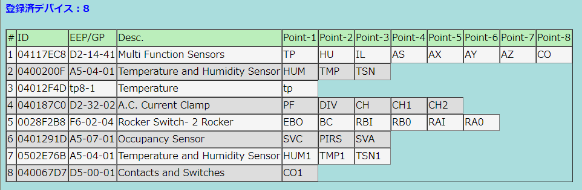<br/>
画面　EnOcean 登録済デバイス表示
</div>

#### 3.2.2. センサーデバイスの新規登録

「新規登録」モードを実行すると、既存のセンサー登録設定を削除して、新規センサーの登録を開始します。このモードで動作中に登録するセンサーの「LEARN」ボタンを押して、センサーを登録してください。
「運用」モードに切り替えることで、「登録」モードを終了します。
**この「新規登録」モードの実行により、確認無しで登録済の全センサーの情報が削除されます。**ご注意ください。

#### 3.2.3. センサーデバイスの追加登録

「追加登録」モードを実行すると、センサーの追加登録を開始します。このモードで動作中に登録するセンサーの「LEARN」ボタンを押して、センサーを登録してください。「運用」モードに切り替えることで、「登録」モードを終了します。

#### 3.2.4. 運用

登録済センサーのデータを受信します。ゲートウェイ起動時はこのモードで動作しています。

登録済のセンサーからのデータだけを受信して、ゲートウェイ機能としてETK、あるいはOPC UAサーバーとしてデータ転送します。データ受信は、EnOcean無線通信のテレグラムフィルター機能を使用して、登録デバイスのデータだけを取り込みます。EnOcean 通信機器が多い環境でも受信データのバッファーオーバーフローによるデータの取りこぼしがありません。

### 3.3. iBRESS / ETK 設定

- iBRESS ETK 接続

	ラジオボタンの「iBRESS ETK」選択後、iBRESS ETK設定項目（Host, Data Domain, 組織ID / User Name, Password）を入力して、「実行」ボタンをクリックします。3秒程度でETKが新しく設定したパラメーターに従って再起動します。ゲートウェイの起動時は最後に設定した内容に従ってETKが自動起動します。以下に入力例を示します。

<div style="text-align: center;">
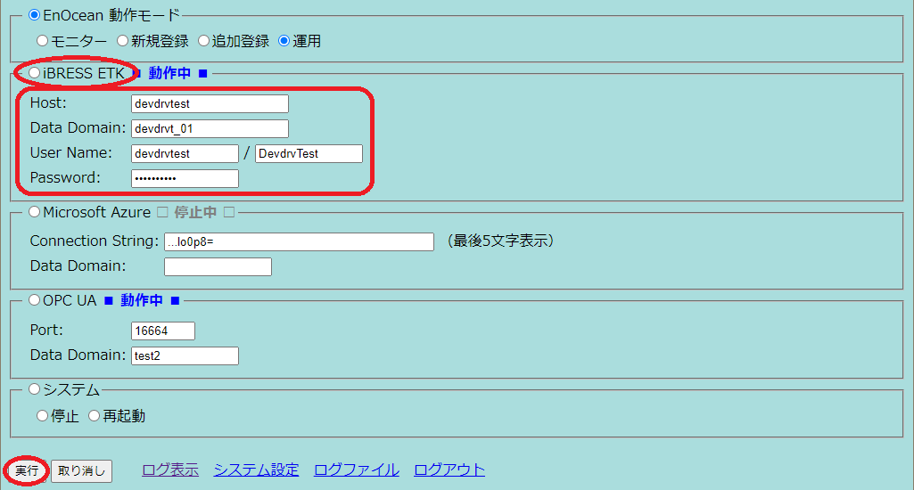<br/>
画面　iBRESS ETK 設定
</div>

- DataHub ローカル接続

	iBRESS ETKの設定で「組織ID」/「User name」,「Password」を設定せずに「空」とした場合には、SSHとWebSocketを使用しない、DataHub 用のオープンな接続モードで動作します。DataHubにローカル接続する場合はこの設定を使用します。

**なお設定内容が間違っている場合、あるいは設定完了時に接続先のiBRESSサーバーに接続できない場合には、通信プログラムのETKが起動しないので、注意してください。**

### 3.4. Azure IoT Hub 設定

機能選択ラジオボタンの「Microsoft Azure」をクリックして、Microsoft Azure IoT Hub の設定を行います。基本的な設定は、接続する IoT Hub の **iothubowner** 権限を持つ **CS (Connection String)** だけです。Connection Stding は入力した最後の5文字だけが表示されます。

**Data Domain** の項目は、Azure IoT Hub には定義されていませんが **Device ID** のプレフィックスを指定します。これは運用上、データポイント名を他の ETK や OPC UA 接続サービスと同様にするための互換性を保つために使用します。プレフィックス（デバイスIDの前に付加する特定の文字列）が必要なければ、空のままとしておきます。その場合、ゲートウェイで自動付加したデータポイント名をそのまま **Device ID** として使用します。

 「実行」ボタンをクリックすると5秒程度で設定と IoT Hub の更新が完了し、接続プログラム (IoT Edge) が再起動します。この設定した内容は保存され、ゲートウェイの再起動時には設定した内容で、自動的に Azure IoT HUb 通信を開始します。

<div style="text-align: center;">
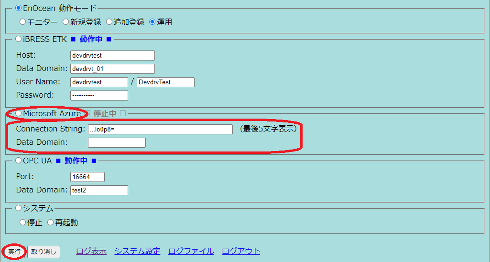<br/>
画面　Azure IoT Hub 設定
</div>

### 3.5. OPC UA 設定

機能選択ラジオボタンの「OPC UA」をクリックして、OPC UAサーバーの設定を行います。設定はサーバーのPort番号とデータDomain名だけです。「実行」ボタンをクリックして設定が完了し、OPC UAサーバーが再起動します。
この設定した内容は保存され、ゲートウェイの再起動時には設定した内容で、自動的にOPC UAサーバーを開始します。

<div style="text-align: center;">
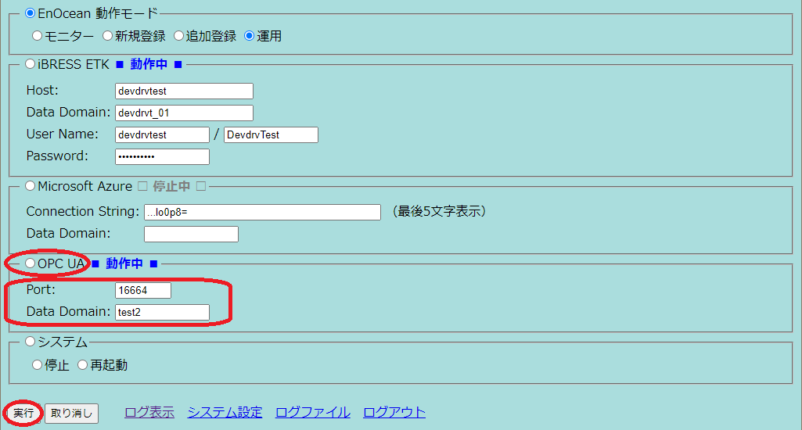<br/>
画面　OPC UAサーバー設定
</div>

### 3.6. システム 設定

コントローラーページの「システム設定」のリンクをクリックすると、次の様な「システム設定」ページに移動します。以下にシステム設定ページの各設定項目を示します。


<div style="text-align: center;">
<br/>
画面　システム設定ページ
</div>

システム設定ページでは次の機能をサポートしています。

- IPアドレス確認と設定
- ユーザー設定
- バージョン情報表示

またこのページには、ファームウェア更新ページへの移行リンクがあります。各項目の設定について説明します。

#### 3.6.1. IPアドレス設定

E-Kit EnOcean ゲートウェイのIPアドレスを「自動（DHCP）」または「手動設定（固定IPアドレス）」のいずれかに設定します。手動設定の場合はさらに「IPアドレス」、「Net Mask」、「IP Gateway」、「DNS」、「ドメイン名」の設定を次の通り行います。各設定内容はすぐには設定されず、再起動後に有効になります。

- IPアドレス

	IPV4アドレスを設定します。

- Net Mask

	サブネット マスク(Subnet Mask)をマスクの上位ビット数または、「255.255.255.0」の様なIPアドレス形式で設定します。現在の設定状況はマスクの上位ビット数（「255.255.255.0」の場合は「24」など）を表示します。

- IP Gateway

	インターネットに接続するためのゲートウェイのIPアドレスを設定します。

- DNS1

	接続先の名前解決で使用する1台目のDNSのIPアドレスを設定します。

- DNS2

	接続先の名前解決で使用する2台目のDNSのIPアドレスを設定します。DNSはDNS1またはDNS2のいずれか、あるいは両方を設定してください。

- ドメイン名

	ローカルネット接続で使用するドメイン名を設定します。

IPアドレス設定時は設定項目ラジオボタンで「IPアドレス」を選択し、IPアドレスの種別を「自動（DHCP）」または「手動設定」のどちらかを選択します。「手動設定」時は各設定項目を入力します。この例ではNet Maskを「255.255.255.240」として設定していますが、上位28ビットをマスクするので「28」と入力しても同じです。入力設定後は「設定」ボタンをクリック後、再起動してください。

#### 3.6.2. ユーザー設定

E-Kit EnOcean ゲートウェイにログインするユーザー名、またはパスワードを変更する場合に設定します。ログイン用ユーザーは1種類だけが登録可能です。**パスワードを忘れてしまった場合に復帰する方法はないので、設定を変更する場合には、十分気を付けて運用してください。**

- ユーザー名

	新しいユーザー名を入力して設定します。

- パスワード

	新しいパスワードを入力して設定します。変更しない場合でも必ず入力してください。

- 確認入力

	パスワードの確認入力です。前項に入力したのと同じパスワードを再度入力してください。

ユーザー名の設定時はまずラジオボタンで「ユーザー名」を選択し、新たに設定する「ユーザー名」「パスワード」「確認入力」を入力後、「設定」ボタンをクリックします。ユーザーの設定変更は、その場ですぐに実行されるので、設定後は新しいユーザー設定で再度ログインする必要があります。

#### 3.6.3. バージョン情報表示

E-Kit EnOcean ゲートウェイ 搭載のシステムソフトウェア（ファームウェア）の名称とバージョンを表示します。

- Loader:  	アプリケーション・ブートローダー
- Web UI:  	Web UI 表示ソフトウェア
- EnOcean:  EnOcean 通信ソフトウェア
- ETK:  	ETK ソフトウェア
- AZURE:  	Microsoft Azure IoT Hub 接続ソフトウェア
- OPC UA:  	OPC UA サーバーソフトウェア

### 3.7. モニター機能

EnOcean テレグラムの受信状況を示すモニター機能には、次の２種類があります。

- 全テレグラムのモニター

- 操作対象テレグラムのモニター

全テレグラムのモニターは、EnOcean 動作モードを「モニター」に設定して「実行」することで動作します。 ゲートウェイ操作対象テレグラムのモニター機能は、コントローラーページの「ログ表示」のリンクをクリックすることで動作します。次に表示例を示します。モニターページで「取り消し」をクリックすることで終了します。

<div style="text-align: center;">
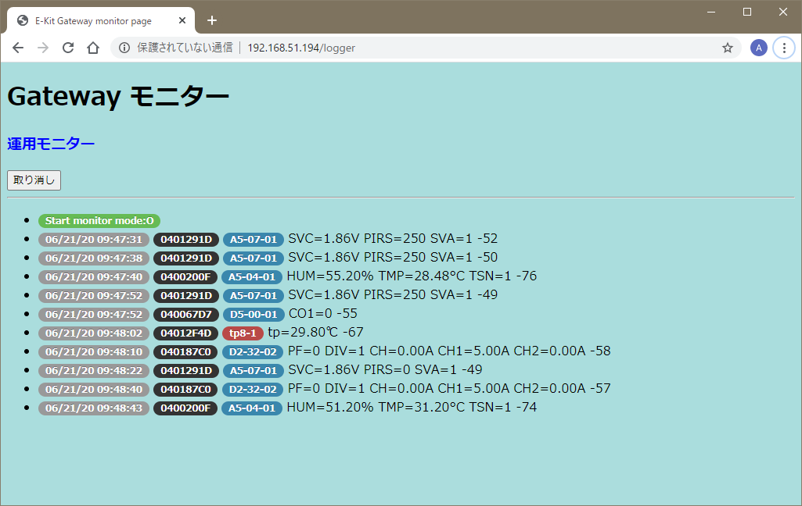<br/>
画面　操作対象テレグラムのモニター
</div>

### 3.8. ログファイル機能

コントローラーページの「ログファイル」のリンクをクリックすることで、EnOcean ゲートウェイの動作状況記録を管理、表示するログファイル設定ページに移動します。次の設定と操作が可能です。

- 記録したログファイルの内容表示とダウンロード

- ファイルに記録するログの対象設定

- 指定期間の過去ログファイルの削除

<div style="text-align: center;">
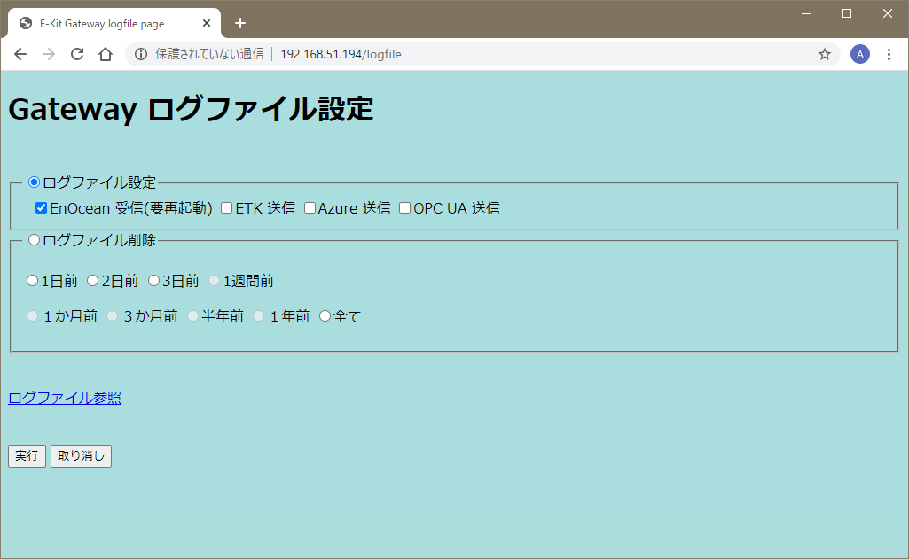<br/>
画面　ログファイル設定ページ
</div>

#### 3.8.1. ログファイル名

各ログファイルは次の規則で名前付けられ、システムの再起動時または24時間毎に更新します。

```sh
mod-yyyymmdd-hhmmdd.log
```

- mod: 次のログ対象モジュールのいずれか

	- btl: ゲートウェイシステム全体の起動・管理モジュール
	- dpr: EnOcean 受信モジュール
	- gui: Webサーバー + Web GUIモジュール
	- etk: iBRESS / ETK 通信モジュール
	- azr: Azure IoT Edge V1 通信モジュール
	- opc: OPC UA サーバー通信モジュール

- yyyymmdd: ログ取得開始の西暦年月日

- hhmmdd: ログ取得開始時刻（時分秒）

各ログファイル内のメッセージ行には、主に動作の開始、終了、通信、操作内容が時刻情報とともにCSV形式で記録されます。

#### 3.8.2. ログファイル一覧

取得したログファイルはモジュール別、日付順で一覧表示します。

<div style="text-align: center;">
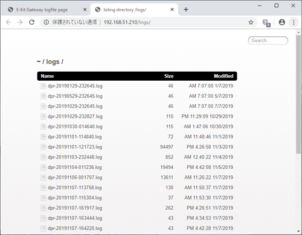<br/>
画面　ログファイル一覧表示（ファイル名クリックで内容表示）
</div>

#### 3.8.3. ログファイル表示

各ログファイルはファイル拡張子は .log ですが、CSV形式で記録しています。ブラウザの表示画面で、そのままダウンロード可能です。

<div style="text-align: center;">
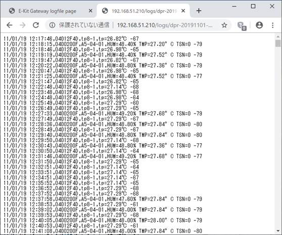<br/>
画面　ログファイル表示例
</div>


### 3.9. ファームウェア更新

E-Kit EnOcean ゲートウェイ搭載のシステムソフトウェア（ファームウェア）は、機能向上や不具合の解消、新機能の追加のため、バージョンアップする場合があります。更新用ファームウェアは DDP 拡張子を持つ特殊な形式の圧縮ファイルで、ホームページまたはメールなどで配布します。

新しいファームウェアへの更新作業は、「システム設定ページ」の「ファームウェア更新」リンクをクリックして表示される「ファームウェア更新ページ」で行います。以降に、更新手順を示します。

<div style="text-align: center;">
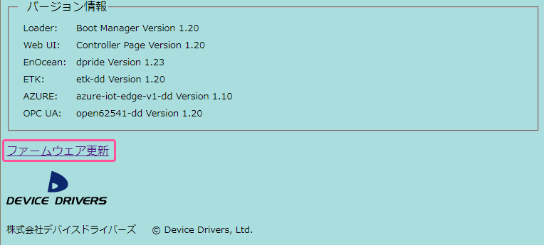<br/>
画面　ファームウェア更新リンク
</div>

- ファームウェア更新ページ

	ファームウェア更新リンクのクリックにより、次のファームウェア更新ページに移動するので、「参照」をクリックして入手したファームウェアを選択するファイルダイアログを開きます。
 
<div style="text-align: center;">
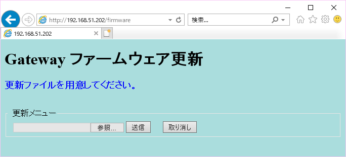<br/>
画面　ファームウェア更新ページ
</div>

- アップロードするファイルの選択

	次の「アップロードするファイルの選択」ダイアログが開くので、ファイラーを操作して入力した更新用ファームウェアファイルを選択し「開く」をクリックします。下記画面の例は「C:\TEMP\ekitgw-000000.ddp」というファイルを選択しています。

<div style="text-align: center;">
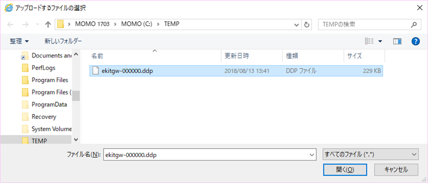<br/>
画面　ファイルの選択ダイアログ
</div>

- アップロード送信

	更新メニューに選択したファイル名が表示されるので確認して、「送信」ボタンをクリックしてアップロード転送します。
 
<div style="text-align: center;">
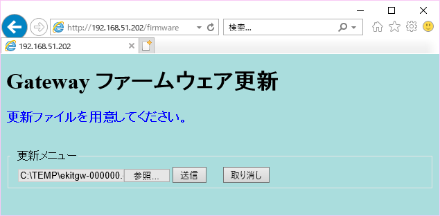<br/>
画面　更新ファイル確認
</div>

- 更新完了

	通常は１～2秒程度で更新が完了するので、「確認」ボタンをクリックして「コントローラーページ」に移動し、再起動して下さい。
 
<div style="text-align: center;">
<br/>
画面　ファームウェア更新完了
</div>

## 4. 補足情報

### 4.1. 緊急用IPアドレスへの接続

ゲートウェイの緊急用固定IPアドレス、192.168.249.249 (サブネットマスク255.255.255.0＝24ビット) に接続する方法を示します。通常の環境では、この緊急用IPアドレスに接続できないので、ここでは、操作しているWindows PC（自マシン）に192.168.249.0/24のサブネットのIPアドレスを追加する手順を紹介します。

192.168.249.0/24サブネットに接続する設定変更が可能であれば、LinuxやMacintoshなど、Windows以外のマシンを使用してアクセスすることも可能です。また、IPアドレスを追加せずに一時的に変更するなど、他の方法で試しても構いません。

#### 4.1.1. 自マシンのアドレス追加

- ネットワークと共有センター

	Windows PCの「ネットワークのプロパティ」、またはコントロールパネルの「ネットワークと共有センター」を開いて、「アダプター設定の変更」をクリックします。

<div style="text-align: center;">
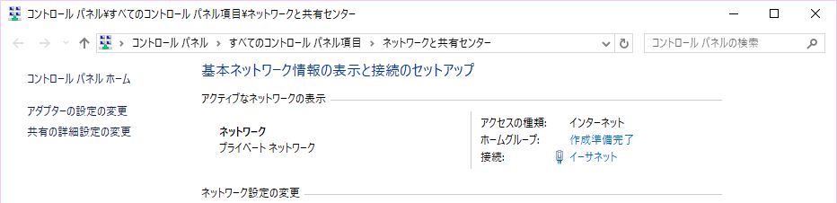<br/>
画面　ネットワークと共有センター
</div>

- ネットワークとインターネット

	Windows 10では前記の代わりに「設定」→「ネットワークとインターネット」→「ネットワーク接続の変更：アダプターのオプションを変更する」を選択しても同じです。

<div style="text-align: center;">
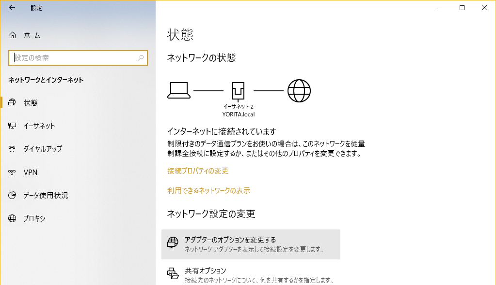<br/>
画面　設定：ネットワークとインターネット
</div>

- イーサネットアダプターのプロパティ

	「ネットワーク接続」のアイコンメニューで有効なアダプターを選択後、右クリックしてイーサネットアダプターの「プロパティ」を選択して開きます。
 
<div style="text-align: center;">
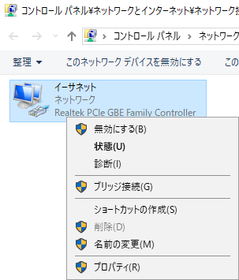<br/>
画面　ネットワーク接続メニューのプロパティ選択
</div>

- イーサネットのプロパティ

	開いたイーサネットのプロパティで、「インターネット プロトコル バージョン 4 (TCP/IPv4)」にチェックしてあるアダプターを選択します。IPv4のインターネットプロトコルを選択後「プロパティ」ボタンをクリックして、「インターネット プロトコル バージョン 4 (TCP/IPv4)のプロパティ」を開きます。


<div style="text-align: center;">
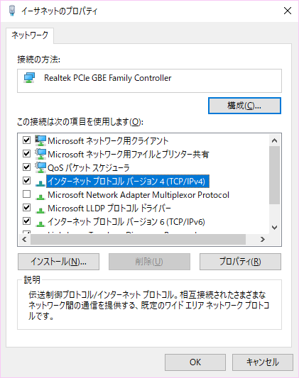<br/>
画面　イーサネットのプロパティ
</div>

- インターネット プロトコル バージョン 4 (TCP/IPv4)のプロパティ

	現在設定はそのまま残してIPアドレスを追加するため、「詳細設定」をクリックします。
 
<div style="text-align: center;">
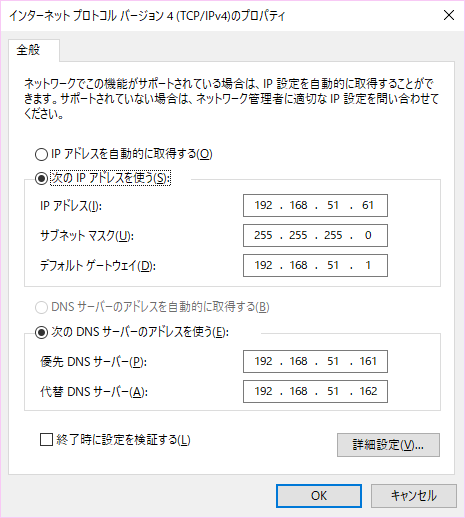<br/>
画面　インターネット プロトコル バージョン 4 (TCP/IPv4)のプロパティ
</div>

- TCP/IP 詳細設定

	操作しているマシンに新しいIPアドレスを追加するため、IPアドレスの「追加」ボタンをクリックします。
 
<div style="text-align: center;">
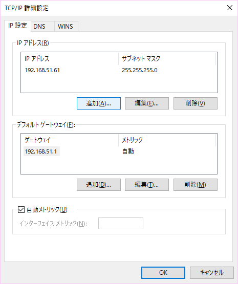<br/>
画面　TCP/IP 詳細設定
</div>

- TCP/IP アドレスの追加

	表示された「TCP/IP アドレス」ダイアログに、追加する「IPアドレス」「192.168.249.1」と「サブネット マスク」「255.255.255.0」を入力して「追加」ボタンをクリックします。
 
<div style="text-align: center;">
<br/>
画面　TCP/IP アドレスの追加入力
</div>

- TCP/IP 詳細設定の確認

	TCP/IP 詳細設定の画面で、IPアドレスが「192.168.249.1」に、サブネット マスクが「255.255.255.0」に設定されていることを確認して、「OK」ボタンを押してTCP/IP 詳細設定を閉じます。同様に「OK」ボタンで「インターネット プロトコル バージョン 4 (TCP/IPv4)のプロパティ」、「イーサネットのプロパティ」を閉じます。
 
<div style="text-align: center;">
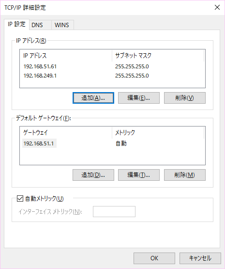<br/>
画面　TCP/IP 詳細設定の確認
</div>

これでゲートウェイの緊急用固定IPアドレスに接続できる様になりました。固定IPアドレスを設定する場合には、ブラウザを起動して、URL入力欄に緊急IPアドレスの「192.168.249.249」を入力して接続し、ログインします。ログイン後は、3.5項の「システム設定」の説明に従って固定IPアドレスを設定後、再起動してからご利用ください。

## 5. サポートと保証

本製品は、日本国内の屋内の一般的な利用環境で使用された場合には、不具合発生時にご購入後1年間の無償修理による保証を行います。保証期間内であっても、規定外の利用や改造による故障、火災・地震や台風等の天災が原因の場合は、無償保証の対応外とさせて頂きます。

不具合でお困りの場合、あるいは保証に関して不明な点はご購入先、または株式会社デバイスドライバーズ E-Kit事業部「e-kit@devdrv.co.jp」宛にメールでお問い合わせください。

<div style="text-align: right;">
株式会社デバイスドライバーズ<br/>
E-Kit事業部<br/>
© 2020 Device Drivers, Ltd.
</div>
